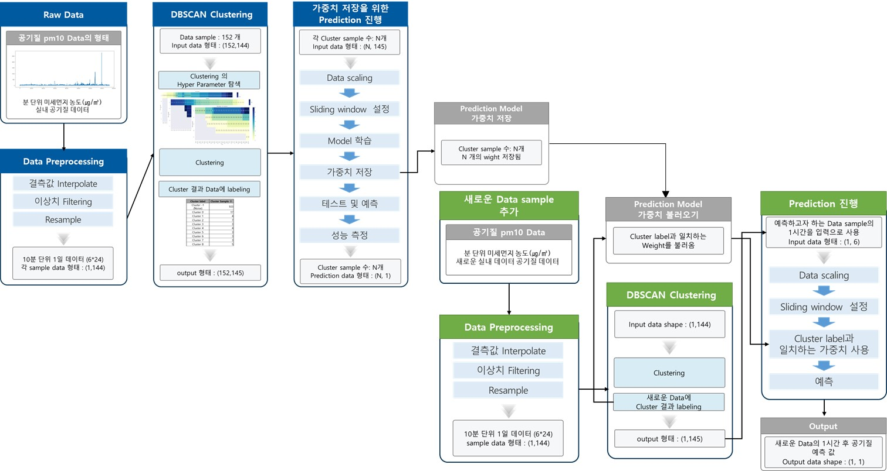

## AIR Quality Code




### clustering

- 7일 및 1일 기간 Cluster code

### data procession

- 데이터 전처리 및 필터링 진행 code

### forecasting

- Clustering된 결과 data 공기질 예측 진행 code

#### Dataset은 아래와 같은 디렉토리 위치에 넣어야함

```sh
└─air-quality
  │  README.md
  ├─clustering
  ├─data procession
  │      Dataset
  │      
  ├─forecasting
  └─image

```
<br>
